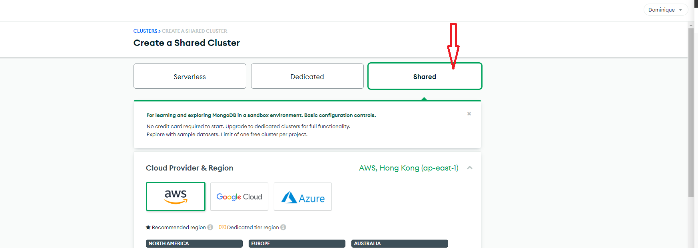
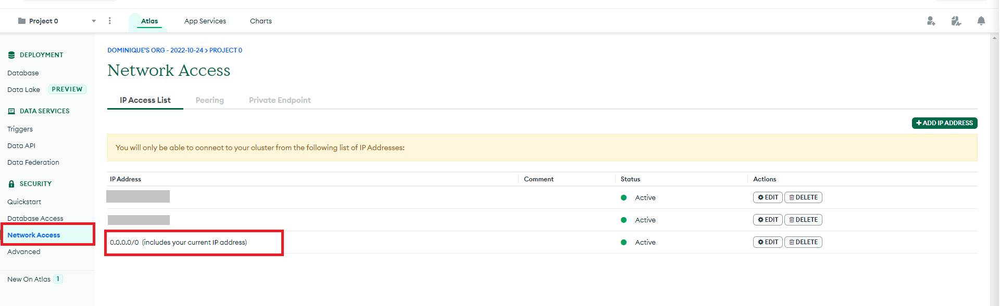
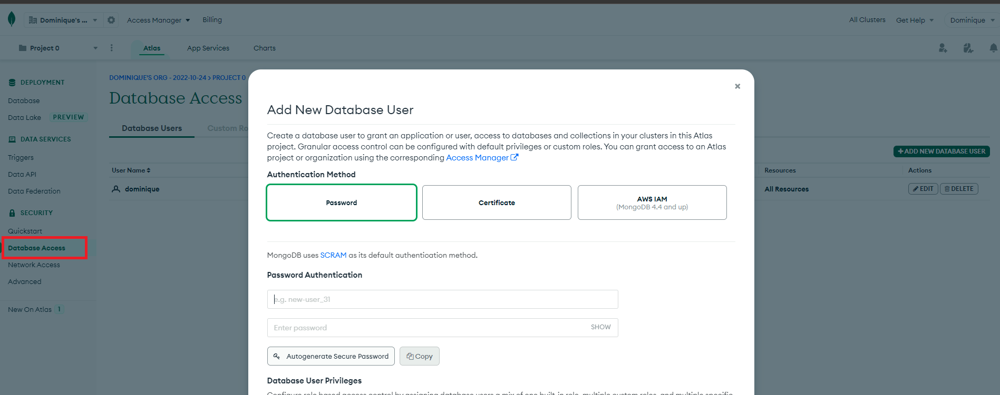
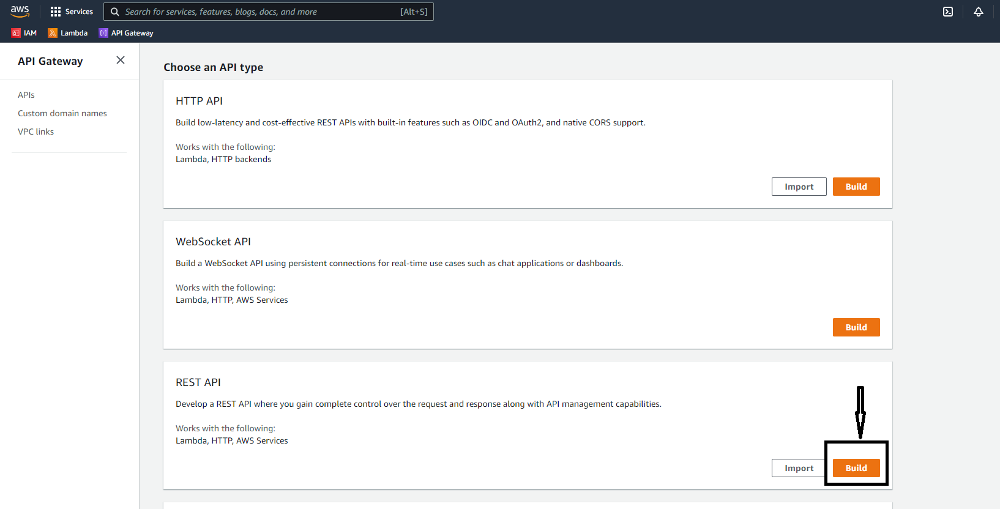
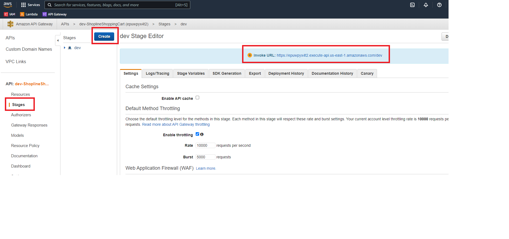
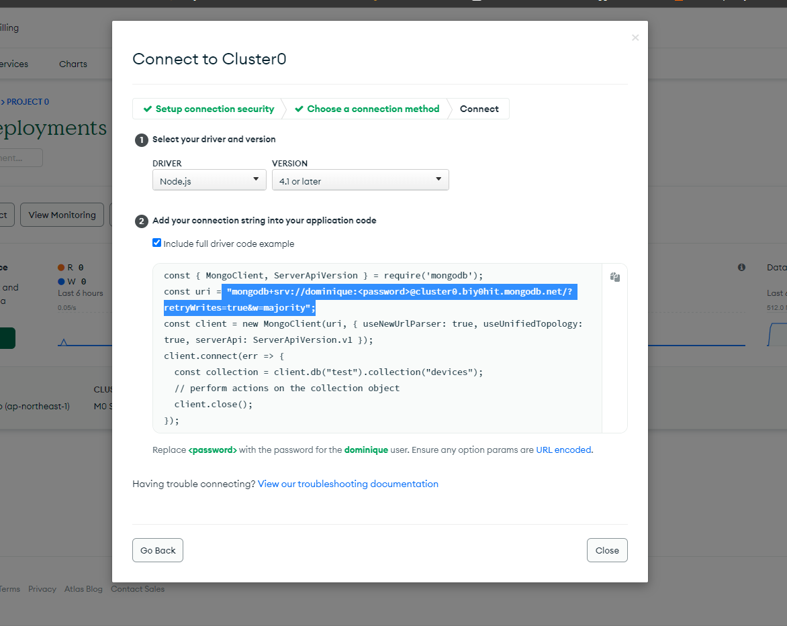
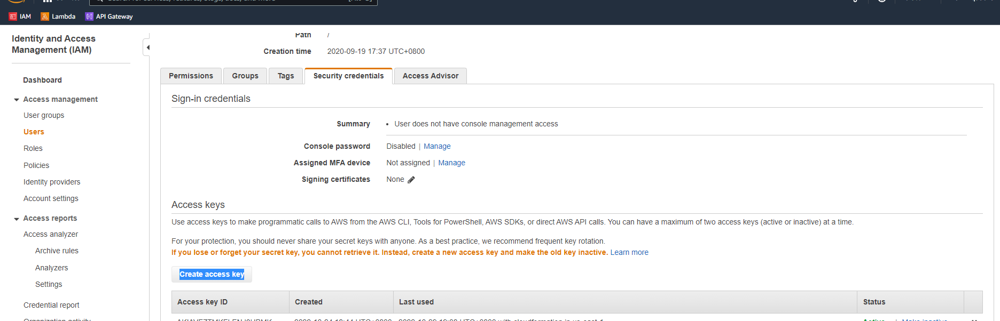
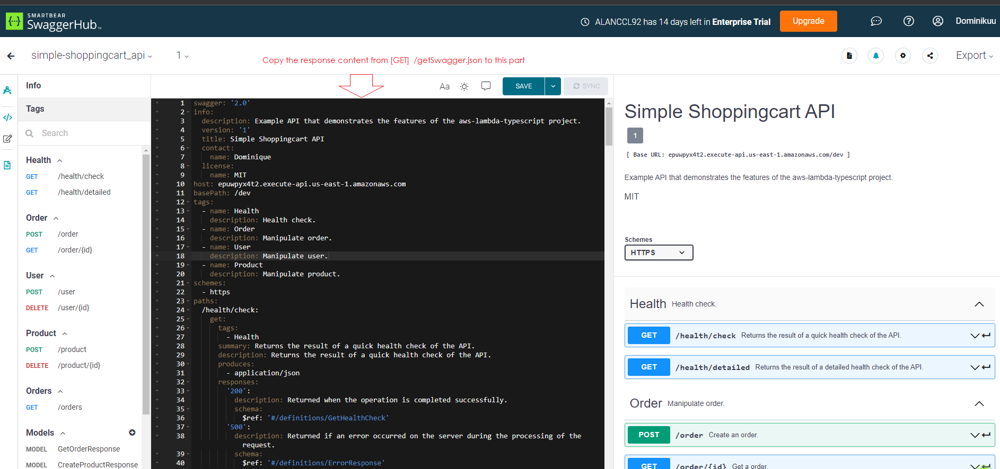
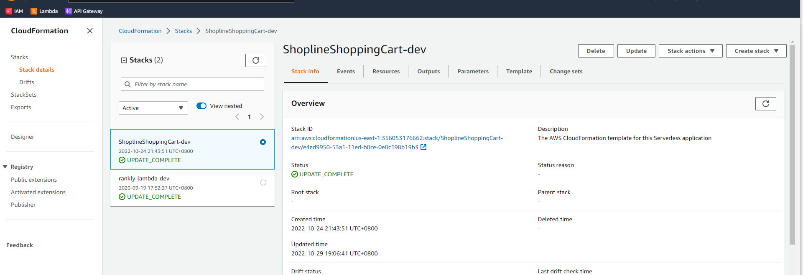
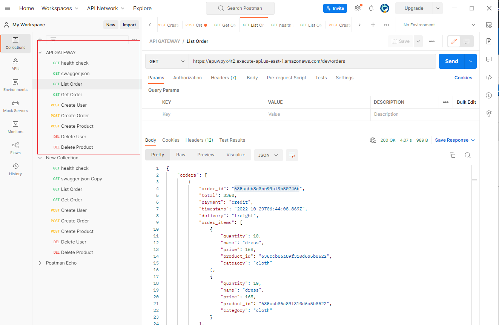

# nodejs-mongo-lambda
This sample uses the Serverless Application Framework to implement small APIs using AWS Lambda function for shoppingcart  in TypeScript, deploy it via CloudFormation, and publish it through API Gateway.

## Prerequisite
- Nodejs 15.4.0
- serverless 3.23.0

## Environment setup
- Create Monogodb in Mongo Altis





- AWS Gateway




- Setup .env file


```
REST_API_NAME=ShoplineShoppingCart
STAGE_NAME=dev
API_INFO_TITLE=API_INFO_TITLE
API_INFO_VERSION=1.0.0
MONGO_URI=mongodb+srv://<MONGODB-USERNAME>:<MONGODB-SECRET>@<MONGODB-CLUSTERNAME>.biy0hit.mongodb.net/?retryWrites=true&w=majority
```
- Install awscli
```
apt-get install awscli
```
- Setup AWS credentials
    
    ```
    aws configure
    ```
    or
    ```
    serverless config credentials --provider aws --key YOUR_ACCESS_KEY --secret YOUR_SECRET_KEY
    ```
- Install Nodejs

- Install Serverless Application Framework
```
npm install serverless -g
```


## Usage
1. Clone repository
  Install dependencies
  ```
  npm install
  ```

2. Customize the name of your service by changing the following line in the serverless.yml file:
  ```
  service: <SERVERLESS-SAMPLE>
  ```

  Give the name for service in serverless.yml file
  ```
  npm run deploy
  ```

3. Test on local
  ```
  npm start
  ```
4. Swagger export
  Call API get json file and paste the response JSON into the Swagger Editor.
  - https://app.swaggerhub.com/apis-docs/ALANCCL92/simple-shoppingcart_api/1
  

5. Deploy
  It runs the analysers (linter + tests) before deployment, and integration tests after deployment.

  ```
  npm run deploy
  ```
  

6. Health check
  Health check endpoints - to quickly test your service.

## Test
- Run linter
  To check your codebase with TSLint, run:
  ```
  npm run lint
  ```
  The linter automatically checks your code before deployment, so you don't need to run it manually.

- Run unit tests
  To check your code with unit tests, run:

  ```
  npm test
  ```
  The unit tests are automatically running before deployment, so you don't need to run them manually.

- Run integration tests
  To verify that your deployment completed successfully, run:
  ```
  npm run test:integration
  ```
- Tese by Postman
  

## Component
### DB/Collection schema

- Users

| COLUMN     | TYPE      |        |
|------------|-----------|--------|
| email      | String    |        |
| first_name | String    |        |
| last_name  | String    |        |
| gender     | String    |        |
| address    | Object    |        |
|            | street    | String |
|            | city      | String |
|            | post_code | String |

- Products

| COLUMN      | TYPE     |
|-------------|----------|
| category    | String   |
| name        | String   |
| price       | Integer  |
| description | String   |

- Orders

|Column       |Type         |
|-------------|-------------|
|user_id      |ObjectId (fk)|
|payment      |String       |
|timestamp    |Datetime     |
|total        |Integer      |
|delivery     |String       |

- OrderItems

| COLUMN     | TYPE         |
|------------|--------------|
| order_id   | ObjectId (fk)|
| product_id | ObjectId (fk)|
| quantity   | Integer      |

## API
- Create new user: 
  ```
  [POST] /dev*/user
  ```
- Delete specific user: 
  ```
  [DELETE] /dev*/user/{userId}
  ```
- Create new product: 
  ```
  [POST] /dev/product
  ```
- Delete specific product: 
  ```
  [DELETE] /dev*/product/{productId}
  ```
- Create new order: 
  ```
  [POST] /dev*/order
  ```
- List all orders: 
  ```
  [GET] /dev*/orders
  ```
- Get specific user: 
  ```
  [GET] /dev*/user/{userId}
  ```

[*] In local environment, /dev/ could be ignored.
If access more detail, please check https://app.swaggerhub.com/apis-docs/ALANCCL92/simple-shoppingcart_api/1

# Troubleshooting
### Offline POST API not working
```
nvm install 15.4.0
nvm use 15.4.0
```

### Install guide for nvm in Linux
https://tecadmin.net/how-to-install-nvm-on-ubuntu-20-04/

### Install AWS cli in Windows
https://docs.aws.amazon.com/zh_tw/cli/v1/userguide/install-windows.h

# TODO
- Raise up Test coverage
- Resolve lint warning
- Extract node_modules to layer